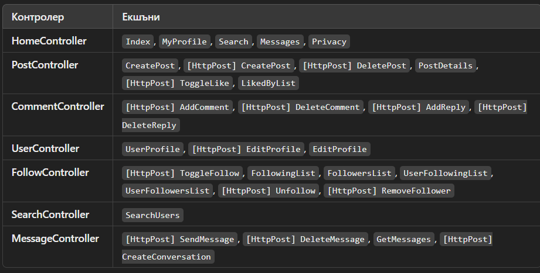

# Freedle - Social Network 🚀
*A modern and funcional social network built with ASP.NET Core MVC, .NET 7.0, EF Core, MSSQL, SignalR, JavaScript, AJAX, Bootstrap 

## 📌 Project Overview
Freedle is a full-stack social media platform designed with scalability and interactivity in mind. It allows users to share posts, interact with comments, follow/unfollow others, and engage in real-time chat using SignalR.

### 🔥 Key Features
- **User Authentication** (Identity Library for secure login and registration) 🔐
- **Post System** (Create, like, and comment on posts with AJAX interactions) 📝
- **Follow/Unfollow** (Stay connected with other users – implemented via **Controller logic**) 🔄
- **Real-Time Chat** (Powered by SignalR for instant messaging) 💬
- **Search Users** (Efficient searching with AJAX for dynamic results) 🔍
- **Modern UI** (Designed with Bootstrap and Razor Pages) 🎨

---

## 🛠️ Technologies Used

- **Backend:** C#, ASP.NET Core MVC, SignalR
- **Frontend:** HTML&CSS, Razor Pages, Bootstrap, JavaScript, AJAX
- **Database:** MSSQL with Entity Framework Core
- **Version Control:** Git & GitHub
- **Hosting:** Local

---

## 📷 Screenshots
### 🖼️ Controllers and Actions


---

## ⚙️ Installation & Setup

1️⃣ Clone the repository:
```sh
 git clone https://github.com/Viliyancho/Freedle.git
```

2️⃣ Navigate to the project folder:
```sh
cd Freedle
```

3️⃣ Configure the database in `appsettings.json`:
```json
"ConnectionStrings": {
  "DefaultConnection": "Your_MSSQL_Connection_String"
}
```

4️⃣ Apply Migrations & Update Database:
```sh
dotnet ef database update
```

5️⃣ Run the application:
```sh
dotnet run
```

---

## 📌 Project Structure
```plaintext
📂 Freedle
├── 📂 (M)odels            # Database models for EF Core
├── 📂 (V)iews             # UI with Razor Pages
├── 📂 (C)ontrollers       # Business logic (User, Post, Comment, Message, Follow, Search and etc.)
├── 📂 wwwroot           # Static assets (CSS, JS, images)
├── appsettings.json     # Configuration file
└── Program.cs           # Entry point
```

---

## 🚀 Future Improvements
- ✅ Host with Microsoft Azure
- ✅ Add email sending functionality using SendGrid
- ✅ Optimize database queries for better performance

---

## 📜 License
MIT License. Feel free to use and modify. 😃

---

## 📩 Contact
📧 [vvr.vichos@gmail.com] | 🌐 [https://www.linkedin.com/in/viliyanraychov/]
